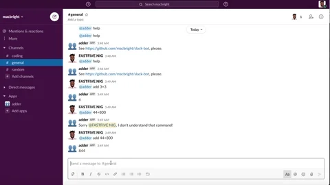

<h1 align=center> ** Slack-Chat-Bot Adder** </h1>

[](https://github.com/RichardLitt/standard-readme)
[](https://david-dm.org/dwyl/esta)


- This is a simple slack chat bot that adds two numbers.
- Eg: when the user types to the bot `234 + 123`, it should respond back with `357`
- If the input does not have two numbers or has addition symbol in between, it 			  	responds back with a error message - Sorry, I didn't understand that. I only add    	numbers in this format. eg: 5+6 or 6+3





## Background

- Ruby
- Rspec


## Usage

```sh
$ git clone https://github.com/macbright/slack-bot slack-bot
```
<br /> Clone the repository to your local machine


```sh
$ cd slack-bot
```
<br /> cd into the directory

`$ bundle install` 
<br /> to install all the gems

`` 
<br /> you will have to go slack [website](https://slack.com/services/new/bot)
	to create your own API TOKEN. 
	after getting the API TOKEN, create a .env in your root directory save the token like this: SLACK_API_TOKEN = your_api_token.

`$ rspec` 
<br /> check if all the test are passing

`$ rackup` 
<br /> to start up the puma server


## Maintainers 

👤  **Bright Okike**

- Github: [@macbright](https://github.com/macbright)
- LinkedIn: [@bokike](https://www.linkedin.com/in/bokike/)
- Twitter: [@b_okike](https://twitter.com/b_okike)

## Future Features
1. add  arithmetic  operations
2. makes it operations with more than two numbers
3. add more operations other than arithmetic


## Contributing

1. Fork it (https://github.com/macbright/slack-bot.git)
2. Create your feature branch (git checkout -b feature/[choose-a-name])
3. Commit your changes (git commit -am 'What this commit will fix/add')
4. Push to the branch (git push origin feature/[chosen name])
5. Create a new Pull Request

## License

Bright okike
[MIT license](https://opensource.org/licenses/MIT).